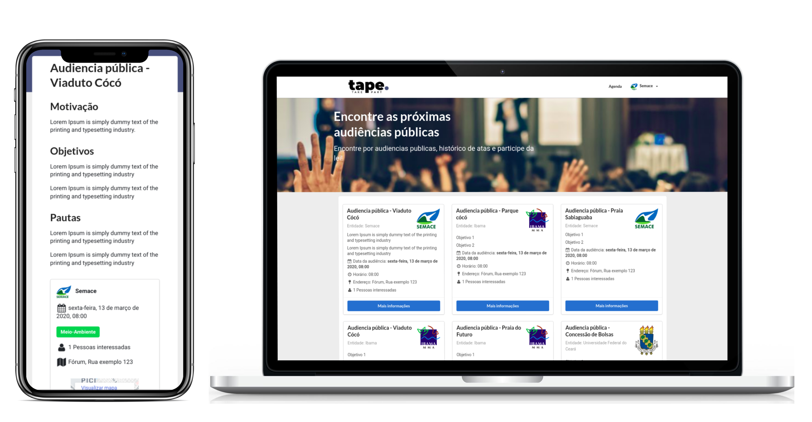

# Tape - Global Legal Hackathon

  

This is a NextJS app built on Global Legal Hackathon 2020 - Fortaleza - CE and considered the **second best idea** by the event judges.

## :computer: Technologies
This project was built with the following technologies:
- [Node.js](https://nodejs.org/en/)
- [React](https://reactjs.org)

## :exclamation: The project
Tape is an web app made for creation, publicity and management of public audiences.
